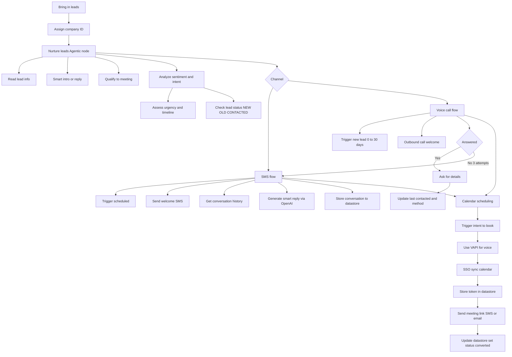
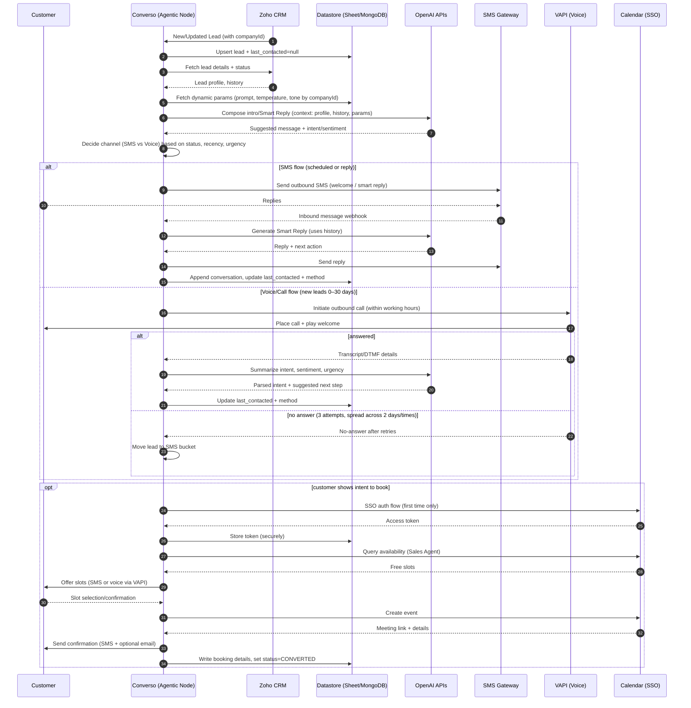

# Converso

## Terminology
- **DataStore** – Google Sheet / MongoDB  
- Google Sheet for Testing MongoDB

## Flow

### Bring in the leads
- Connect via CRM / Spreadsheet  
- Use Zoho as our CRM (acts as the database)  
- Leads should have a **company ID** to identify that they belong to different companies under Converso  

### Nurture Leads
- **Agentic Node** (used in both SMS / Call Flow)  
  - Read the lead information and understand the service requested  
  - Create an initial intro message or Smart Reply if history exists  
  - Replies should aim to qualify the clients by setting up a meeting with a sales agent  
- **Analyze Sentiment**  
  - Understand intent  
  - Sense urgency (of the current state)  
  - Timeline of the customer  
  - Based on Lead Status (NEW, OLD, CONTACTED, etc.)  

The node should use a dynamic file (like a spreadsheet) so Converso can fine-tune the prompt, temperature, and tone based on a company ID.  
Based on the conversation, tone, and sentiment, tailor the reply and actions accordingly so the customer is fully satisfied.  

---

## SMS
- **Trigger**: Scheduled  
- Send a welcome SMS (Outbound flow)  
- Based on the incoming message:  
  - Look for conversation history and create Smart Reply using OpenAI APIs  
  - Send the reply and store conversations in the datastore  

---

## Voice / Call
- **Target**: New Lead (immediate to 1 month old max)  
- **Trigger**: Whenever a lead is created  
  - Make an outbound call, play the welcome message, and ask for details (within client’s working hours)  
- Retry rules:  
  - If no answer after 3 attempts → move lead to SMS bucket/flow  
  - Attempts spread over 2 different days/times (configurable)  
- Update **last contacted timestamp** and **contact method** in the datastore  

---

## Calendar Scheduling / Booking  
*(used in both SMS / Call Flow)*  

- **Trigger**: When the user responds to SMS/voice with an intent to book a meeting with a sales agent  
- Use **VAPI** as a platform for call/voice  
- Use **SSO authentication** to sync with the Sales Agent’s calendar to see availability  
- Once authenticated, store the API key/token in the datastore so the workflow can read/write into the calendar  
- Send **email + SMS notification** with the meeting link once booked  
- Update all this information in the datastore, and update the lead status to **CONVERTED**

## Flow

## Sequence Diagram
