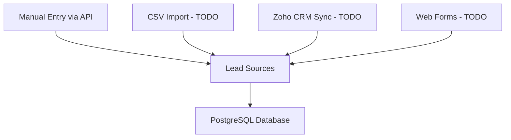
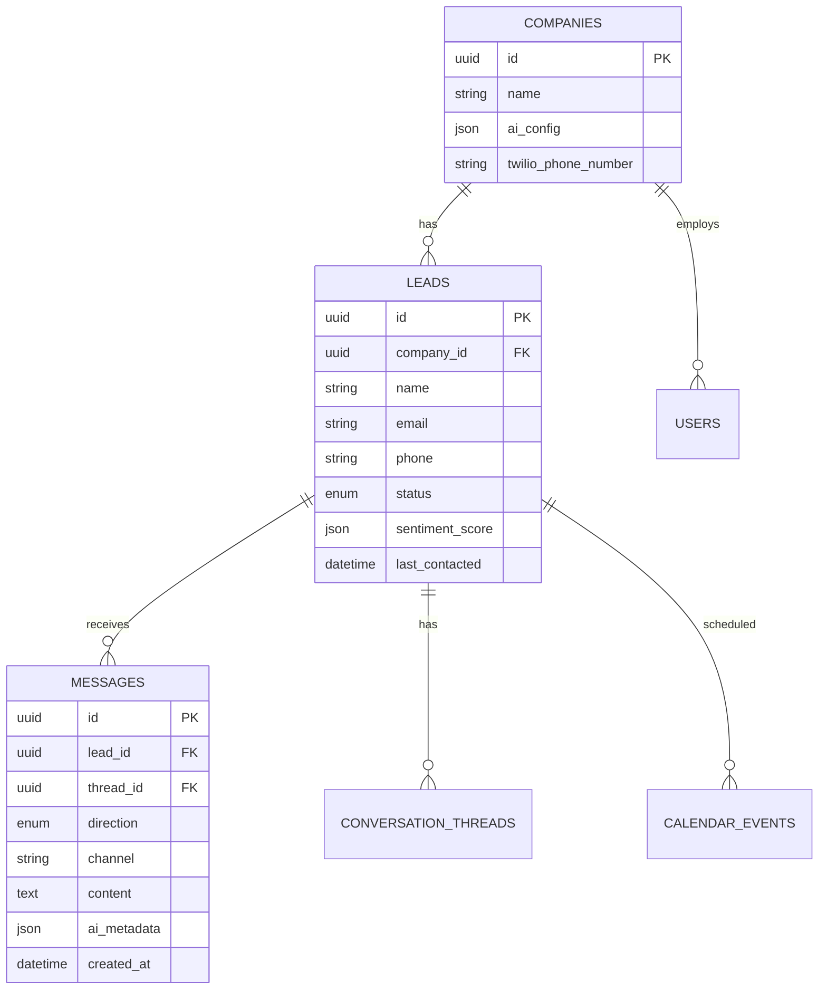
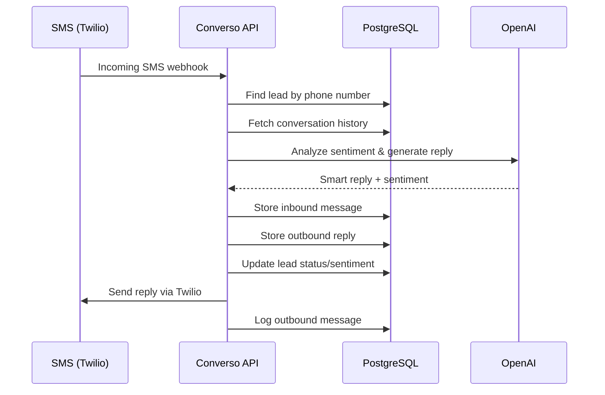

# Converso Data Flow & Storage

## 📍 Where Data Lives

### **1. Lead Sources**


### **2. Data Storage Architecture**


### **3. SMS Conversation Flow**


## 🗄️ Database Tables

### **1. `leads` Table**
- **Purpose**: Store all potential customers
- **Key fields**: phone (for SMS matching), sentiment_score, last_contacted
- **Updated**: Every interaction

### **2. `messages` Table**
- **Purpose**: Complete conversation history
- **Stores**: 
  - SMS content (inbound/outbound)
  - Voice transcripts
  - AI analysis metadata
  - Timestamps

### **3. `conversation_threads` Table**
- **Purpose**: Group related messages
- **Stores**: Context, summary, active status

## 🚀 Quick Start: Add Test Data

### **Option 1: Use the Script**
```bash
# After starting the app with docker-compose
python scripts/populate_test_data.py
```

### **Option 2: Use API**
```bash
# Create a lead
curl -X POST http://localhost:8000/api/leads \
  -H "Content-Type: application/json" \
  -d '{
    "name": "Test User",
    "email": "test@example.com",
    "phone": "+14165551234",
    "company": "Test Corp",
    "interest": "Product demo"
  }'
```

### **Option 3: Direct SQL**
```sql
-- Connect to PostgreSQL
docker-compose exec postgres psql -U converso

-- Insert test lead
INSERT INTO companies (id, name) VALUES 
  (gen_random_uuid(), 'Default Company');

INSERT INTO leads (id, company_id, name, email, phone, status) VALUES 
  (gen_random_uuid(), 
   (SELECT id FROM companies LIMIT 1),
   'John Doe',
   'john@example.com',
   '4165551234',
   'new'
  );
```

## 📱 Testing SMS Flow

1. **Add a lead** (phone must match your test phone)
2. **Send SMS** to your Twilio number
3. **Check database**:
   ```sql
   -- View messages
   SELECT * FROM messages ORDER BY created_at DESC;
   
   -- View lead updates
   SELECT name, phone, status, sentiment_score 
   FROM leads;
   ```

## 🔍 Where to Find Data

- **Leads**: `http://localhost:8000/api/leads`
- **Messages**: `http://localhost:8000/api/messages/lead/{lead_id}`
- **Database**: `docker-compose exec postgres psql -U converso`
- **Logs**: `docker-compose logs -f app`

## 📊 Future Integrations

The PRD mentions these lead sources (not yet implemented):
1. **Zoho CRM** - Automatic lead sync
2. **Google Sheets** - Import/export
3. **Web Forms** - Direct capture
4. **CSV Upload** - Bulk import